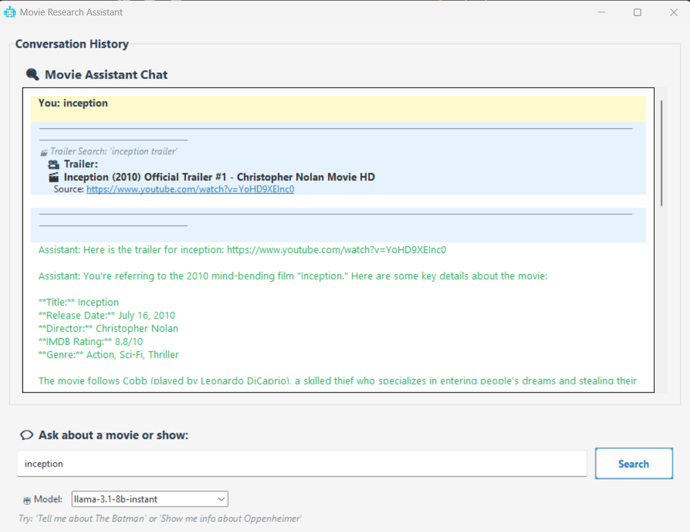
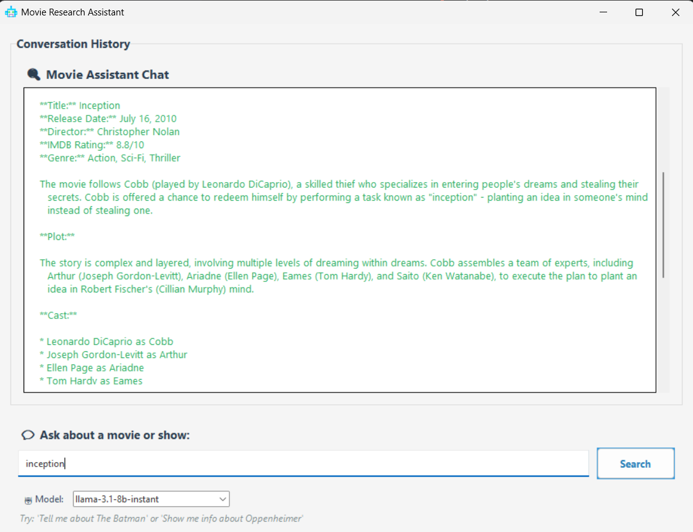

# 🎬 Movie Research Assistant

A Python-based RAG (Retrieval-Augmented Generation) application that helps users discover information about movies and TV shows, including ratings, cast details, release dates, and trailers.

<p align="center">
  
</p>

## 📋 Overview

Movie Research Assistant is a desktop application that combines modern LLM capabilities with specialized search tools to provide comprehensive information about films and television shows. The system retrieves information from multiple sources and presents it in a clean, intuitive interface.

## ✨ Features

- **Intelligent Queries**: Ask natural language questions about any movie or TV show
- **Comprehensive Movie Data**: Get IMDB ratings, release dates, directors, and cast information 
- **Trailer Integration**: Automatically finds and links to official trailers on YouTube
- **Conversation History**: Full record of your conversation with the assistant
- **Multiple LLM Support**: Switch between different language models based on your needs

## 🔧 Technologies

- **Python & Tkinter**: Lightweight GUI framework for desktop applications
- **RAG Architecture**: Combines search tools with LLM capabilities
- **Groq API**: Fast and efficient LLM inference
- **DuckDuckGo Search**: Web search integration for finding movie information
- **YouTube API**: For discovering official trailers and video content

## 🚀 Getting Started

### Prerequisites

- Python 3.8 or higher
- API keys for:
  - Groq (for LLM access)
  - YouTube API (for trailer search)
  - (Optional) OMDB API (for direct movie data access)
  - (Optional) Google API (for google search, I've used duckduckgo as default for now)

### Installation

1. Clone the repository:
   ```
   git clone https://github.com/MauryaRitesh/movie-research-assistant.git
   cd movie-research-assistant
   ```

2. Create a virtual environment: `python -m venv venv`
3. Activate the environment:
   - Windows: `venv\Scripts\activate`
   - Unix/MacOS: `source venv/bin/activate`
4. Install dependencies: `pip install -r requirements.txt`
5. Copy `.env.example` to `.env` and add your API keys
6. Run the application: `python main.py`

## 💻 Usage

1. Type your movie-related question into the input field at the bottom
2. Hit Enter or click the "Search" button
3. The assistant will:
   - Search for relevant information using DuckDuckGo
   - Find a trailer using YouTube
   - Process the information through the LLM
   - Provide a comprehensive response
   - Display all search results in the conversation history

Example queries:
- "Who directed Inception and when was it released?"
- "Tell me about The Batman"

## 🧠 How It Works

The application uses a Retrieval-Augmented Generation (RAG) approach:

1. User query is processed by the ConversationManager
2. Multiple search tools extract relevant information:
   - DuckDuckGo Search for general web information about the movie/show
   - YouTube Search for official trailers
3. All retrieved information is compiled into context
4. The LLM (via Groq) generates a comprehensive response using the search results
5. Both the raw search results and the LLM's response are displayed to the user

## 📁 Project Structure

```
project/
├── main.py               # Application entry point
├── assets/
│   └── icon.png          # Application icon
├── core/
│   ├── conversation.py   # Manages conversation flow and tool calling
│   ├── llm.py            # Interface with Groq LLM API
│   └── search.py         # Search tool implementations
└── ui/
    ├── app.py            # Main application window
    ├── components.py     # UI components and widgets
    └── styles.py         # Application styling and themes
```

## Screenshots

<p align="center">
  
  
</p>


## 🛠️ Customization

### Changing the LLM Model

Use the dropdown menu in the interface to switch between available models:
- llama3-70b-8192 (default)
- llama3-8b-8192
- mixtral-8x7b-32768
- gemma-7b-it

### Adding New Search Tools

To add a new search tool:
1. Create a new class that inherits from `SearchTool` in `search.py`
2. Implement the `search` method
3. Register the tool in `RAGApp.setup_tools()` in `app.py`

## 🔜 Future Enhancements

- Image support for movie posters
- Comparison of multiple movies/shows
- More sophisticated filtering of search results
